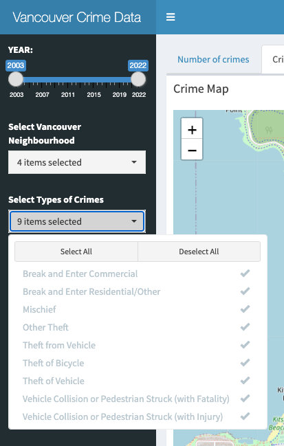
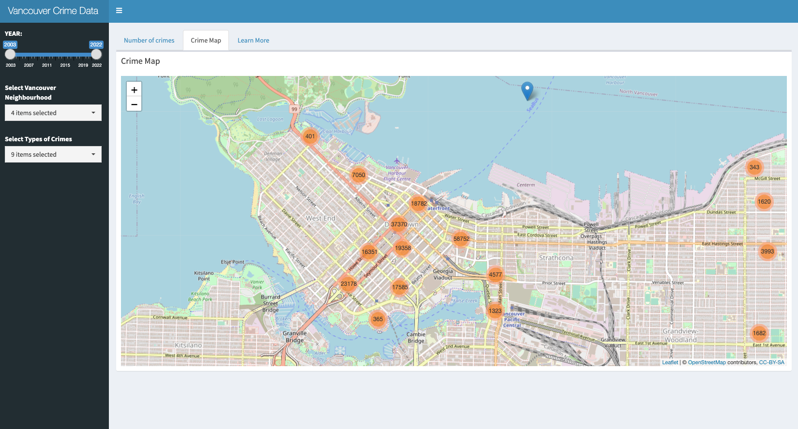
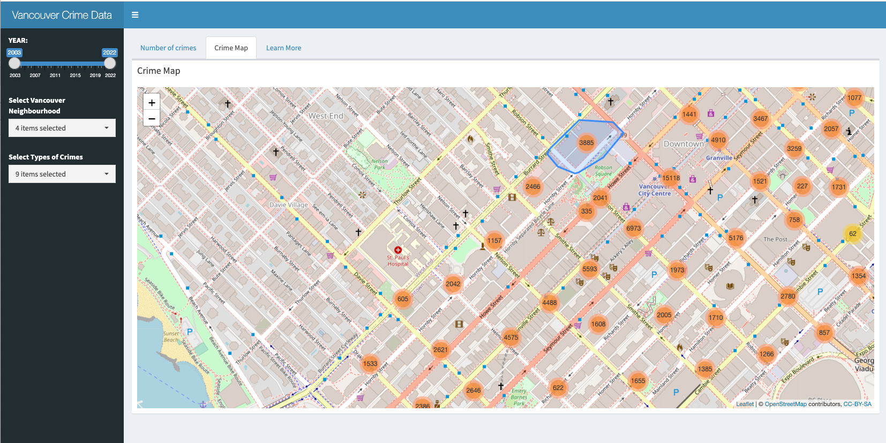
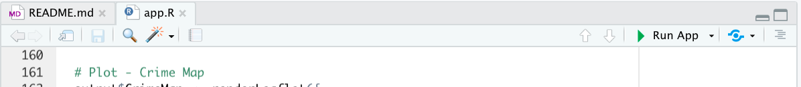

# VanCrime

## Overview

Thank you for visiting the VanCrime app project repository. This repository hosts the dashboard for the Vancouver (Canada) crime data released by the Vancouver Police Department ([VPD](https://vpd.ca/)). This information, which spans 2003 through 2022, is public domain and is licensed under [CC0](https://creativecommons.org/publicdomain/zero/1.0/).

This README file serves as a central location for the project's documentation. You may either go directly to a subsection of interest or continue reading to learn more.

* [Who are we and what is this app about?](#who-are-we-and-what-is-this-app-about)
* [How to use this app?](#how-to-use-this-app)
* [How to get involved and contribute?](#how-to-get-involved-and-contribute)
* [Getting started](#getting-started)
* [License](#license)
* [Credits](#credits)
* [Quick Links](#quick-links)

## Who are we and what is this app about ?

We are a team of [UBC MDS](https://masterdatascience.ubc.ca/) students that created this fantastic Shiny app for our [Data Visualization II](https://ubc-mds.github.io/course-descriptions/DSCI_532_viz-2/) group project.

In a nutshell, this is a dashboard application that helps users and interested parties visualize Vancouver crime data, publicly released by the Vancouver Police Department ([VPD](https://vpd.ca/)). The information will be arranged in a manner that takes into account the different types of criminal behavior, as well as the time periods and neighbourhoods involved. It is important to note that the purpose of this dashboard is not to label any specific area of Vancouver with a negative connotation, but rather to educate. For a detailed description of the motivation, description, and usage scenarios, please visit [Proposal](reports/proposal.md).

## How to use this app ?

The program follows a conventional dashboard layout in which the user can select or specify the scope of what they need to visualize on the left side, and a set of relevant visualization components that update in response to the user's selection criteria on the right.

Here's a link to the live [application](https://markusnam.shinyapps.io/VanCrime/) if you like to check it out.


This dashboard application includes:

-   Filter the crime statistics by beginning and ending years to display it (in the convenient form of a slider)

-   Focus on a certain Vancouver neighbourhood by applying a filter (in the form of a multi-selection widget)

-   Filter the type of Crime to query (also in the form of a multi-selection widget)

    {width="279"}

The components of the visualization are separated into tabs. The first tab, "Number of crimes," enables the user to visualize a variety of important metrics:

-   The average number of offences within a period of 24 hours.

-   The progression of the number of crimes per neighbourhood over the specified years

-   Lastly, the number of offences by filtering categoriess



The second tab, titled "Crime Map," is an interactive map of Vancouver, that overlays the count of crimes per region, enabling the user to:

-   See the crime rate per region (neighbourhood and city block of Vancouver)

-   Drill-down to street level to get a breakdown per block, down to the individual crime level.

-   Zoom in and out to obtain fine-grained or coarse-grained area counts.



## How to get involved and contribute ?

Anyone interested in helping us improve this dashboard and take on some of the following tasks are especially welcome to get in touch. Areas that we are interested in improving are:

1.  Improve the performance of the dashboard
2.  Increase the visual components' degree of interaction. For instance, we frequently spend effort enhancing the functionality of the map section by adding features such as the capability to modify the filter on the left side of the page in accordance with the selection made on the map (a two-way binding)
3.  Establish a CI/CD Environment
4.  Enhance test suites by including coverage testing.

We love to have you contribute to this dashboard, and the next section will help you get started with that and guide you through the setup.

## Getting started

Interested in contributing? Check out the [contributing guidelines](CONTRIBUTING.md). Please note that this project is released with a Code of Conduct. By contributing to this project, you agree to abide by its terms.

To setup your development environment to contribute to VanCrime please follow these instructions below:

1.  If you don't have RStudio IDE installed, please [install RStudio](https://posit.co/downloads/)

2.  Clone this [repository](https://github.com/UBC-MDS/VanCrime) and create a development branch

    ``` console
    $ git switch -c name-of-your-contributing-branch
    ```

3.  Open `VanCrime.Rproj` from the root of the clone repository using RStudio

4.  Open `app.R` from the Files view on RStudio. RStudio will prompt you to install the dependent packages. Please proceed with RStudio's recommendation to install these dependencies (RStudio will automatically install them if you choose to proceed).

5.  You're almost there. While you have app.R open, click on the Run button at the top right corner of the the editor view. This will launch VanCrime app

    

6.  Congratulations, you are now able to develop and contribute to the VanCrime dashboard application. You might want to brush up Shiny by consulting this awesome reference: [Mastering Shiny](https://mastering-shiny.org/)

## License

`VanCrime` was created by Morris Chan, Markus Nam, Andy Wang and Tony Zoght. It is licensed under the terms of the [MIT license](LICENSE).

## Credits

The sketch of `VanCrime` dashboard was created with [`Balsamiq`](https://balsamiq.com/wireframes/).

## Quick Links

-   [VanCrime Live Application](https://markusnam.shinyapps.io/VanCrime/)
-   [Issues](https://github.com/UBC-MDS/VanCrime/issues)
-   [Proposal](reports/proposal.md)
-   [Contributing Guidelines](CONTRIBUTING.md)
-   [Code of Conduct](CODE_OF_CONDUCT.md)
-   [License](LICENSE)
