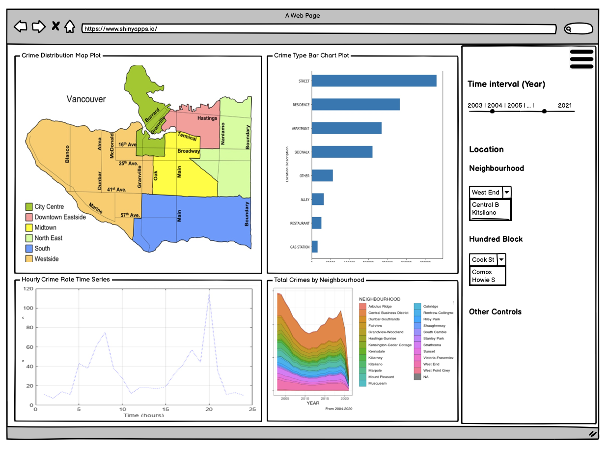

# VanCrime

## Overview

This repository hosts the dashboard for the Vancouver (Canada) crime data released by the Vancouver Police Department ([VPD](https://vpd.ca/)). This information, which spans 2003 through 2022, is public domain and is licensed under [CC0](https://creativecommons.org/publicdomain/zero/1.0/). Background and purpose of this dashboard can be found in our [proposal](proposal.md).

## Description of the Dashboard

We will create 4 different visualizations within the dashboard. \* The first plot is a map chart that displays the distribution of Vancouver crime across different regions. To further illustrate this distribution, we plan to use a color scale. Additionally, we aim to enhance its functionality by allowing users to filter crime data in the other three plots by simply clicking on a particular region of the map. \* The second plot is a dynamic bar chart that shows crime types based on user input from the widget on the right. \* The third plot shows total number of crimes per year in each neighbourhood. \* The fourth plot is a time series chart that displays the number of crimes within a selected time range, based on user input.

The following actions can be performed on our dashboard :

-   Specify the year interval (from and to years) from the slider control.
-   Filter the visualizations based on a desired neighbourhood and hundred block from the dropdowns.
-   Filter the neighbourhood by clicking on a particular area in the crime map  

## Contributing

Interested in contributing? Check out the [contributing guidelines](CONTRIBUTING.md). Please note that this project is released with a Code of Conduct. By contributing to this project, you agree to abide by its terms.

## License

`VanCrime` was created by Morris Chan, Markus Nam, Andy Wang and Tony Zoght. It is licensed under the terms of the [MIT license](LICENSE).

## Credits

`VanCrime` was created with ...

## Quick Links

-   [Issues](https://github.com/UBC-MDS/VanCrime/issues)
-   [Proposal](proposal.md)
-   [Contributing Guidelines](CONTRIBUTING.md)
-   [Code of Conduct](CODE_OF_CONDUCT.md)
-   [License](LICENSE)
