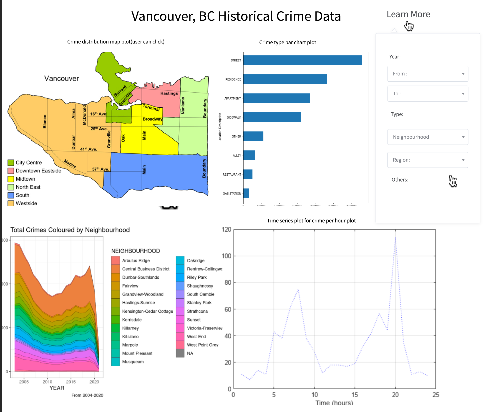

# VanCrime

# Description of the Dashboard

We will create 4 different visualizations within the dashboard.
* The first plot is a map chart that displays the distribution of Vancouver crime across different regions. To further illustrate this distribution, we plan to use a color scale. Additionally, we aim to enhance its functionality by allowing users to filter crime data in the other three plots by simply clicking on a particular region of the map.
* The second plot is a dynamic bar chart that shows crime types based on user input from the widget on the right.
* The third plot shows total number of crimes per year in each neighbourhood.
* The fourth plot is a time series chart that displays the number of crimes within a selected time range, based on user input.

Following actions can be performed on our dashboard :

* Filter the year from a specific year from the dropdown.
* Filter the year to a specific year from the dropdown.
* Filter the visualizations based on a desired neighbourhood of interest from the dropdown.
* Filter the visualizations based on a desired region of interest from the dropdown.

 
